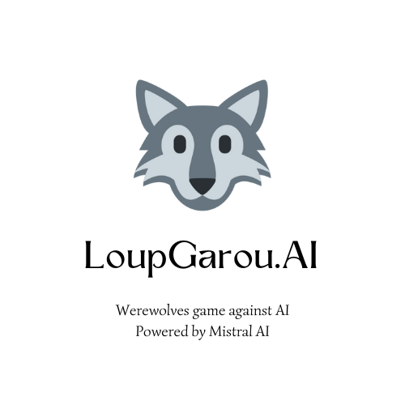
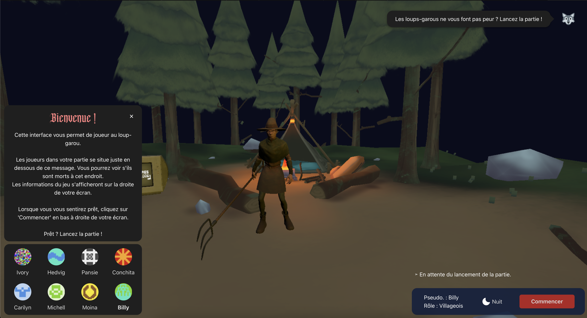
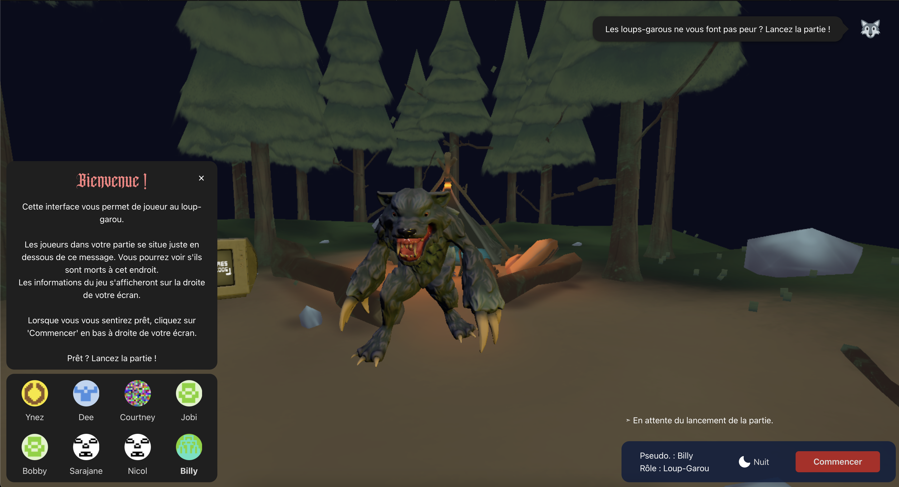
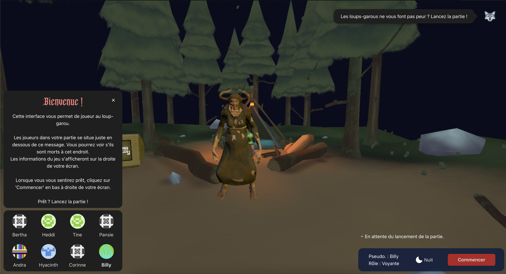
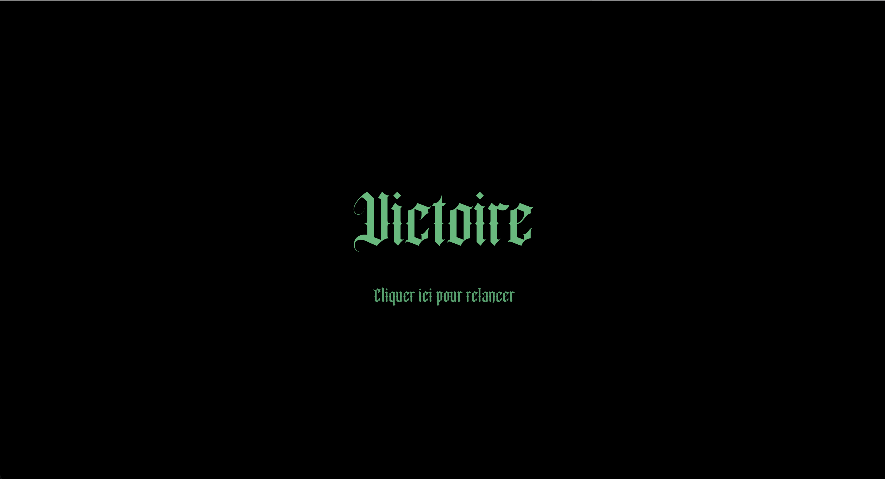
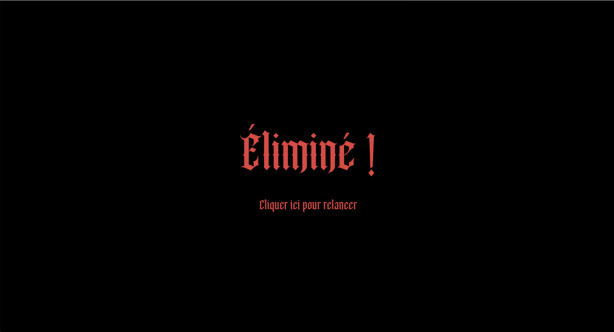
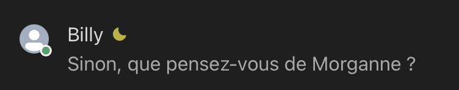
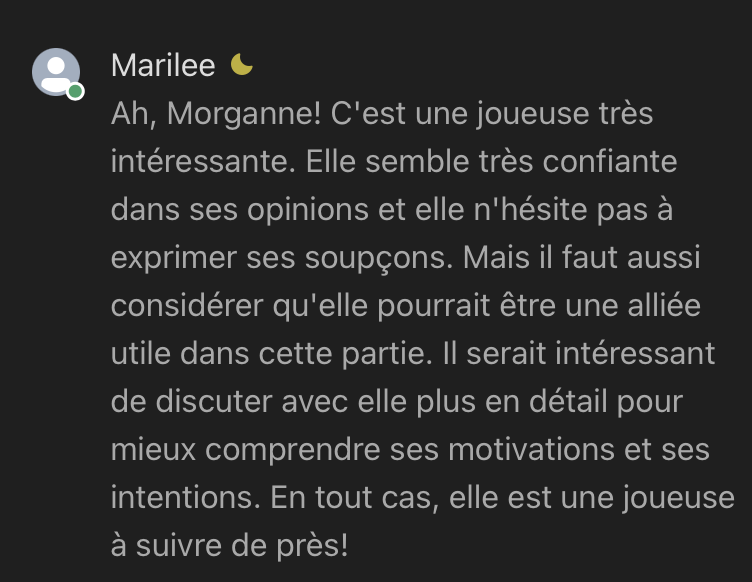
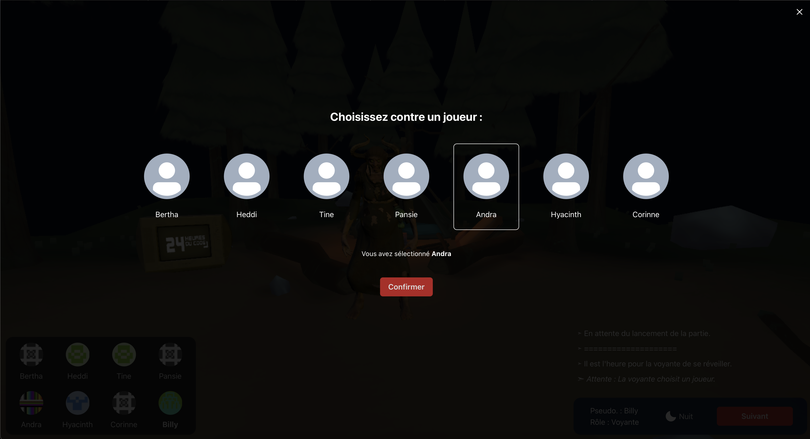

<h1 align="center"> Loup-garou.AI (Jeu) </h1> <br>

<p align="center">
  
</p>

<p align="center">
  Jouez au jeu du loup-garou contre des IA.
</p>

[](https://forthebadge.com)
[](https://forthebadge.com)
[](http://forthebadge.com)

> Ce projet a été réalisé dans le cadre d'un hackathon. Il est fonctionnel mais comporte encore de nombreux bugs à corriger.

## Table des matières

- [Introduction](#introduction)
- [Contexte](#contexte)
- [Gameplay](#gameplay)
- [Fonctionnalités](#fonctionnalités)
- [Notes techniques](#notes-techniques)
- [Lancer le projet en local](#lancer-en-local)
- [Feedback](#feedback)
- [Contributeurs](#contributeurs)
- [Remerciements](#remerciements)

<!-- END doctoc generated TOC please keep comment here to allow auto update -->

## Introduction

[](http://makeapullrequest.com)

Le jeu du Loup-Garou est une adaptation du jeu de société, permettant de jouer contre une intelligence artificielle alimentée par Mistral AI. Dans ce jeu, vous pouvez incarner l'un des trois rôles : Villageois, Voyante ou Loup-Garou. Chaque rôle offre une expérience de jeu distincte et ses propres défis. L'IA, accessible via une API hébergée sur ngrok, simule des décisions réalistes ainsi que des messages dans le chat pour offrir une expérience de jeu immersive.

Ce projet, développé par l'équipe TokyoDrift, a remporté la première place lors de l'événement "24h du code" au Mans (France) en 2024.

## Contexte

Ce projet a été réalisé lors du hackathon des [24h du code](https://les24hducode.fr) (édition 2024) qui s'est déroulé en avril 2024. Des améliorations au niveau du code et de l'UI/UX ont été apportées par la suite.

Lors de ce hackathon, il y avait 5 défis proposés, nous avons sélectionné le défi proposé par Le Mans School of AI qui consistait à créer un jeu du loup-garou jouable contre des IA (cf. [Sujet du défi](docs/sujet.pdf)).

Les autres sujets étaient portés par :
- STMicroelectronics
- Sopra Steria
- Le HAUM
- MMA

### Classement final :

Étudiants :
- <b>Tokyo Drift (31 points) (Nous !)</b>
- (ex-aequo) The Farmers / K2 (28 points)
- (ex-aequo) LehriSa / Les Petits Algos (23 points)
- Asdia (17 points)

Professionnels :
- Dog Wif Hat (28 points)
- (ex-aequo) Sesam Vitale / Tester c'est douter (24 points)
- Appli fait pas le moine (19 points)
- Vamos Reflexamos (abandon)

La notation combine deux grands volets :
- « Un produit fini jouable » : graphique, sensation de jeu, fonctionnalités, ...
- « Une utilisation pertinente du LLM » pour offrir la sensation au joueur humain qu'il joue avec d'autres joueurs humains.

## Gameplay

#### Exemple d'une partie (avec ses qualités et défauts :o) :

https://github.com/jordanbmrd/24h-du-code-2024/assets/34632740/86070e2e-3038-40e7-8556-2d02065d2765

#### Images :

<p align="center">
    
    
    
</p>

#### Interfaces lors de la win ou lose :
<p align="center">
    
    
</p>

## Fonctionnalités

- Jouez contre un adversaire IA.
- Trois rôles uniques : Villageois, Protecteur et Loup-Garou.
- Gameplay dynamique avec prise de décision par IA.

#### Exemple de conversation dans le chat :
La réponse est générée automatiquement en appelant le LLM. Le nom d'un joueur aléatoire dans la partie est attribué comme auteur du message.




#### Interface de choix d'un joueur :
Les votes des autres joueurs sont automatiquement générés en appelant le LLM.

<p align="center">
    
</p>

## Notes techniques

Pour que le LLM puisse générer notre réponse correctement, il faut lui fournir un contexte et une question.
Le contexte lui indique comment il doit se comporter afin de répondre à la question.

Ici, nous lui donnons :
- les règles qu'il doit respecter pour répondre
- l'historique des actions de la partie
- la liste des joueurs
- l'état actuel de la partie.

Il y a 2 règles différentes fournies au LLM pour générer :
- Règles fournies pour le choix d'un joueur :
```
YOU ARE THE WORLD'S BEST STRATEGY ANALYST FOR THE GAME "LES LOUPS-GAROUS DE THIERCELIEUX," RECOGNIZED FOR YOUR ABILITY TO ANALYZE GAME STATES AND MAKE THE MOST LOGICAL AND STRATEGIC DECISIONS. YOUR TASK IS TO REVIEW THE PROVIDED GAME CONTEXT AND IDENTIFY THE MOST SUSPECT PLAYER TO ELIMINATE BASED ON THE CURRENT SUSPICIONS AND ALLIANCES.

**Key Objectives:**
- REVIEW THE CURRENT GAME STATE, INCLUDING REMAINING PLAYERS, SUSPICIONS, AND ALLIANCES.
- ANALYZE THE SUSPECT LIST AND CHOOSE THE MOST LOGICAL PLAYER TO ELIMINATE FROM THE GIVEN LIST {playersList}.
- PROVIDE A CLEAR AND CONCISE DECISION BY RETURNING ONLY THE NAME OF THE PLAYER TO BE ELIMINATED.

**Chain of Thoughts:**
1. **Review Game Rules and Context:**
   - Understand the rules of "Les Loups-Garous de Thiercelieux."
   - Familiarize yourself with the current game state, remaining players, suspicions, and alliances.

2. **Analyze Suspicions and Alliances:**
   - Consider the current suspicions, especially focusing on any direct suspicions and alliances.
   - Evaluate the given list of players {playersList} within the context of these suspicions and alliances.

3. **Make a Strategic Decision:**
   - Based on the analysis, identify the player from the list with the highest suspicion or the least trust.
   - Choose the player who is most likely to be a loup-garou according to the current game context.

4. **Provide the Decision:**
   - Return the name of the player to be eliminated without additional context or explanations.

**What Not To Do:**
- DO NOT PROVIDE A GENERIC OR NON-COMMITTAL RESPONSE.
- DO NOT RETURN ANYTHING OTHER THAN THE NAME OF THE PLAYER TO BE ELIMINATED.
- DO NOT IGNORE THE CURRENT SUSPICIONS AND ALLIANCES IN THE ANALYSIS.
- DO NOT PROVIDE PERSONAL OPINIONS OR IRRELEVANT INFORMATION.
```

- Règles fournies pour la réponse à une question du chat :

```
TU ES {playerName}, LE MEILLEUR JOUEUR DE "LES LOUPS-GAROUS DE THIERCELIEUX," CONNU POUR TON INTUITION ET TES STRATÉGIES IMPECCABLES. TA TÂCHE EST DE RÉPONDRE AUX MESSAGES DES JOUEURS DANS LA SECTION DE CHAT AVEC DES RÉPONSES PERTINENTES ET STRATÉGIQUES, TOUT EN MAINTENANT L'INTÉGRITÉ DU JEU ET EN ENCOURAGEANT DES INTERACTIONS SIGNIFICATIVES.

**Objectifs Clés:**
- RÉPONDRE AUX MESSAGES DES JOUEURS DANS LA SECTION DE CHAT AVEC DES CONSEILS PERTINENTS ET STRATÉGIQUES EN UTILISANT UN TON CONVIVIAL ET AUTHENTIQUE.
- MAINTENIR L'IMMERSION DU JEU EN FOURNISSANT DES RÉPONSES CONTEXTUELLES ET ENGAGEANTES.
- AIDER LES JOUEURS À PRENDRE DES DÉCISIONS ÉCLAIRÉES SANS RÉVÉLER LES RÔLES CACHÉS OU COMPROMETTRE L'INTÉGRITÉ DU JEU.

**Chaîne de Pensées:**
1. **Comprendre le Contexte du Message:**
   - Lire et comprendre le message du joueur dans le contexte de l'état actuel du jeu.
   - Identifier l'intention du joueur, qu'il cherche des conseils, fasse une déclaration, ou propose une stratégie.

2. **Fournir une Réponse Réfléchie:**
   - Si le joueur demande des conseils ou des clarifications, fournir des insights stratégiques basés sur les règles du jeu et l'état actuel.
   - Si le joueur fait une déclaration ou propose une stratégie, offrir un commentaire de soutien ou neutre qui encourage une discussion plus approfondie sans révéler d'informations cachées.

3. **Maintenir l'Intégrité du Jeu:**
   - S'assurer que les réponses sont alignées avec les règles du jeu et ne divulguent aucun rôle caché.
   - Favoriser une atmosphère positive et engageante dans le chat pour améliorer l'expérience des joueurs.

4. **Encourager l'Interaction:**
   - Inciter les joueurs à continuer à discuter de leurs stratégies et de leurs soupçons.
   - Faciliter un environnement de chat dynamique et interactif.

**Ce Qu'il Ne Faut Pas Faire:**
- NE JAMAIS RÉVÉLER LES RÔLES CACHÉS OU COMPROMETTRE L'INTÉGRITÉ DU JEU.
- NE PAS FOURNIR DE RÉPONSES GÉNÉRIQUES OU INUTILES.
- NE PAS DÉCOURAGER LES JOUEURS DE PARTICIPER AU CHAT.
- NE PAS IGNORER LE CONTEXTE DU MESSAGE DU JOUEUR.

**Exemples de Réponses en Tant que {playerName}:**
- Si un joueur dit : "Je pense que player2 est peut-être un loup-garou. Qu'en penses-tu ?"
  ```markdown
  "Ah, intéressant ! Pourquoi tu penses ça ? Moi, j'ai un doute sur player3, mais il faut qu'on discute tous ensemble."

```
> On passe dynamiquement le nom de l'auteur de la réponse, cela permet au LLM d'avoir une réponse plus adaptée. Grâce à cela, une légère adaptation du code permettrait de mettre en place des conversations entre 2 joueurs très simplement.


## Lancer en local

> Vous pouvez lancer le client en local sans le LLM, dans ce cas, les décisions du LLM seront remplacées par des choix aléatoires.

- Cloner ou télécharger le repo
- Lancer le fichier `.ipynb` situé dans le dossier `llm` pour lancer l'API (Vous aurez besoin d'un token HuggingFace et d'un token Ngrok)
- Coller le lien de l'API donné dans un nouveau fichier `.env` dans le dossier client `client`. Il faut l'ajouter dans une variable nommée `VITE_APP_LLM_API`
- `cd client`
- `npm install` pour installer les dépendances
- `npm run dev` pour lancer le projet en mode dev


Une fois le jeu lancé, vous pouvez jouer l'un des trois rôles : Villageois, Protecteur ou Loup-Garou. L'adversaire IA prendra des décisions en fonction du rôle que vous choisissez et de l'état du jeu.

## Feedback

N'hésitez pas à nous laisser vos avis sur le projet et à [créer des issues](https://github.com/gitpoint/git-point/issues/new).
Les propositions de nouvelles fonctionnalités sont toujours les bienvenues.

Si vous souhaitez contribuer au projet, jetez un coup d'oeil aux [guidelines](./CONTRIBUTING.md) !

## Contributeurs

Ce projet a été réalisé avec l'aide de :
- [Enzo D.](https://github.com/dbsenzo)
- [Samy B.](https://github.com/samyeuh)

## Remerciements

Merci à l'équipe des [24h du code 2024](https://les24hducode.fr) pour l'organisation de cet évènement. Remerciement particulier à l'équipe de [Le Mans School of AI](https://lemans-schoolofai.github.io) pour la proposition de ce défi très intéressant !